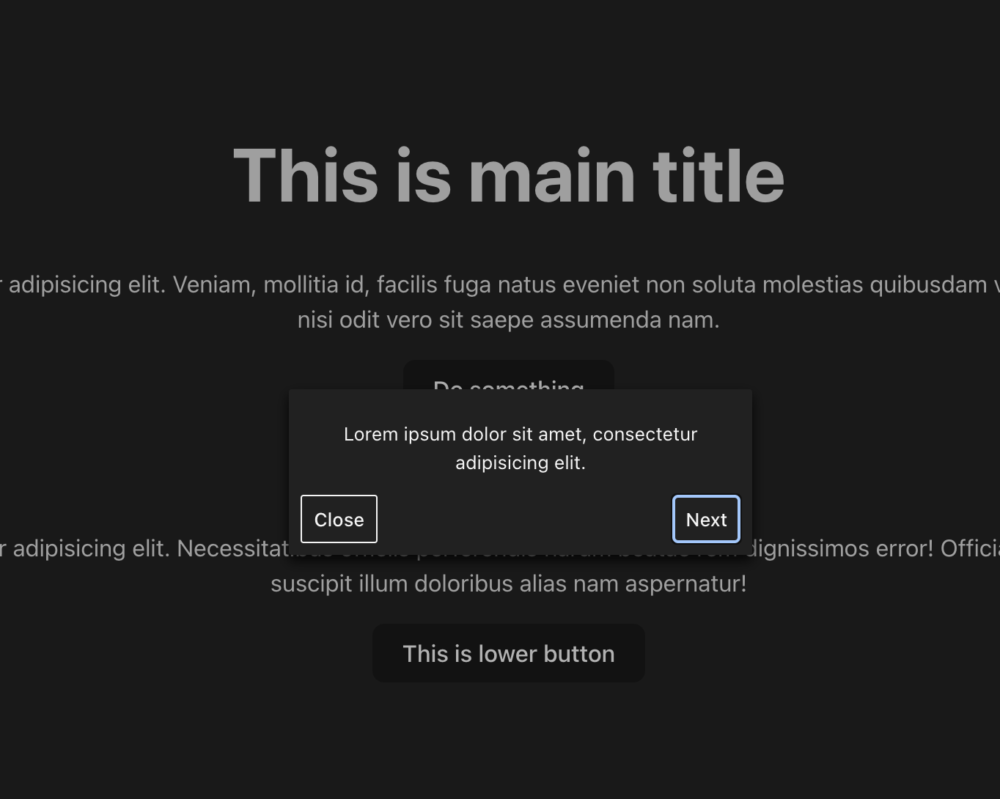

# React UI Walkthrough

## Introduction
<div align="center">
   
</div>

The React UI Walkthrough is a React-based library designed to guide users through a step-by-step tutorial within a web application. By providing contextual tooltips attached to specific elements on the page, the system offers interactive, on-the-spot guidance to enhance user understanding and improve the overall user experience.

## Example

To use the Tutorial Tooltip System, wrap your application's main component with the `TutorialProvider` and pass an array of steps to it. Each step includes the ID of the target element, the text for the tooltip, and optional positioning and style properties.
The `TutorialProvider` component accepts an optional dimStyle property, allowing the user to define custom styling for the dimming overlay effect.

Here's a basic example:

```jsx
import './App.css'
import { HorizontalPosition, TutorialProvider, VerticalPosition } from 'react-ui-walkthrough';

const TutorialSteps=[
  {
    elementId: "a1",
    text: "Lorem ipsum dolor sit amet, consectetur adipisicing elit.",
    verticalPosition: VerticalPosition.Bottom,
    horizontalPosition: HorizontalPosition.Left,
    tooltipStyle: {
      color: 'yellow'
    }
  },
  {
    elementId: "a2",
    text: "Lorem ipsum dolor sit amet, consectetur adipisicing elit.",
    verticalPosition: VerticalPosition.Middle,
    horizontalPosition: HorizontalPosition.Center
  },
  {
    elementId: "a3",
    text: "Lorem ipsum dolor sit amet, consectetur adipisicing elit.",
    verticalPosition: VerticalPosition.Top,
    horizontalPosition: HorizontalPosition.Right
  }
];

function App() {

  return (    <>
    <TutorialProvider steps={TutorialSteps} dimStyle={{
      backgroundColor: 'rgba(0, 0, 0, 0.6)'
    }}>
      <div>
        <h1 id="a1">This is main title</h1>
        <p>Lorem ipsum dolor sit amet, consectetur adipisicing elit. Veniam, mollitia id, facilis fuga natus eveniet non soluta molestias quibusdam voluptatibus dignissimos hic reprehenderit nisi odit vero sit saepe assumenda nam.</p>
      </div>
      <div>
        <button id="a2">Do something</button>
        <h2>This is subtitle</h2>
        <p>Lorem ipsum dolor sit amet consectetur adipisicing elit. Necessitatibus officiis perferendis harum beatae rem dignissimos error! Officia ab eaque eveniet, delectus vitae quis in suscipit illum doloribus alias nam aspernatur!</p>  
      </div>
      <button id="a3">This is lower button</button>  
      </TutorialProvider>
    </>
  )
}

export default App
```

## Using Context
To access the `TutorialContext` within a child component, utilize the useContext hook that React provides. This enables you to retrieve the details of the current step and the entire list of tutorial steps.

```jsx
import React, { useContext } from 'react';
import { TutorialContext } from 'react-ui-walkthrough';

const SomeChildComponent = () => {
  // Access the tutorial context
  const tutorialContext = useContext(TutorialContext);

  if (!tutorialContext) {
    // Handle the case where context is not available
    return null;
  }

  // Use tutorialContext to access the active step or steps array
  const { activeStep, steps } = tutorialContext;

  // Render something based on the context
  return <div>{`Current Step: ${steps[activeStep].text}`}</div>;
};
```